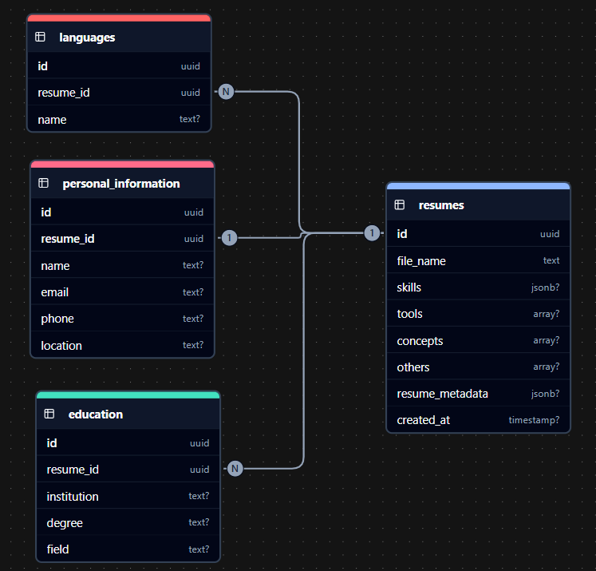
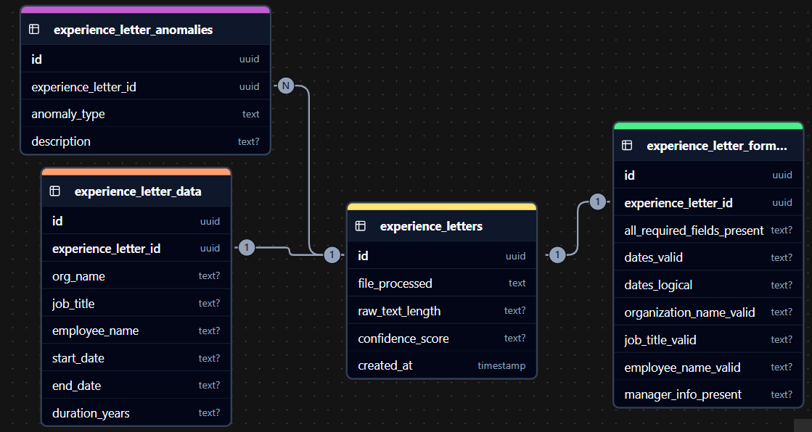
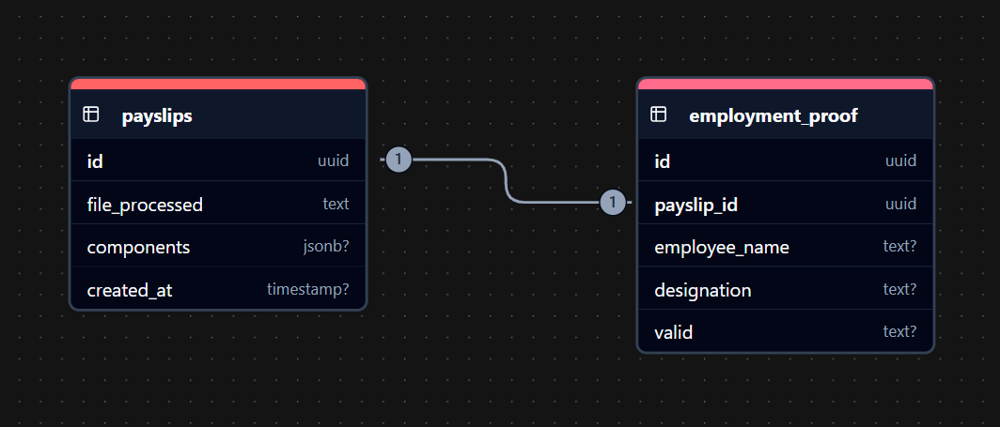

# DocParse
- Tool for parsing documents
- React.js + FastAPI + CockroachDB

# Folder Structure

```
.
├── client
│  ├── eslint.config.js
│  ├── index.html
│  ├── package-lock.json
│  ├── package.json
│  ├── public
│  │  └── vite.svg
│  ├── README.md
│  ├── src
│  │  ├── App.css
│  │  ├── App.jsx
│  │  ├── assets
│  │  │  └── react.svg
│  │  ├── components
│  │  │  ├── DarkModeToggle
│  │  │  │  └── index.jsx
│  │  │  ├── Hamburger
│  │  │  │  └── index.jsx
│  │  │  ├── Navbar
│  │  │  │  ├── index.css
│  │  │  │  └── index.jsx
│  │  │  └── Sidebar
│  │  │     ├── index.css
│  │  │     └── index.jsx
│  │  ├── index.css
│  │  ├── main.jsx
│  │  └── pages
│  │     ├── ExpenseReimbParser
│  │     ├── JoiningDocParser
│  │     │  ├── EdCertParser
│  │     │  │  ├── index.css
│  │     │  │  └── index.jsx
│  │     │  ├── ExperienceLetterParser
│  │     │  │  ├── index.css
│  │     │  │  └── index.jsx
│  │     │  ├── index.css
│  │     │  ├── index.jsx
│  │     │  └── PayslipParser
│  │     │     ├── index.css
│  │     │     └── index.jsx
│  │     └── ResumeParser
│  │        ├── index.css
│  │        ├── index.jsx
│  │        └── info.txt
│  ├── tailwind.config.js
│  └── vite.config.js
├── server
│  ├── config
│  │  └── database.py
│  ├── example_pdfs
│  ├── experience_letter_parser
│  │  └── parser.py
│  ├── main.py
│  ├── models
│  │  └── models.py
│  ├── payslip_parser
│  │  └── parser.py
│  ├── pdf_extractor
│  │  └── extractor.py
│  ├── processed
│  ├── processed_resumes
│  ├── requirements.txt
│  ├── routes
│  │  ├── __init__.py
│  │  └── route.py
│  ├── schema
│  │  └── schemas.py
│  ├── uploads
│  ├── uploads_experience_letters
│  ├── uploads_payslips
│  ├── uploads_resume
│  └── uploads_resumes
│
├── LICENSE
└── README.md
```

## Client

## Server

### `config/database.py`
- Establishes a SQLAlchemy connection to a CockroachDB instance using the provided `DATABASE_URL`.
- Patches SQLAlchemy’s PostgreSQL dialect to correctly parse CockroachDB version strings.
- Initializes the database engine and session factory (`SessionLocal`) for ORM operations.
- Defines a `get_db()` generator function to provide and clean up database sessions (used in FastAPI dependencies).

### `experience_letter_parser/parser.py`
-

### `models/model.py`
-

### `payslip_parser/parser.py`
-

### `pdf_extractor/extractor.py`
-

### `processed/`
-

### `processed_resumes/`
-

### `routes/`
- #### `routes/__init__.py`
-
- #### `routes/route.py`
-

### `schema/schemas.py`
-

│  ├── uploads_experience_letters
│  ├── uploads_payslips
│  ├── uploads_resume
│  └── uploads_resumes

## Database

- Make these tables in your local database:

- for Educational Certificate:

-- Certificates table (main table)
CREATE TABLE Certificates (
    id UUID PRIMARY KEY DEFAULT gen_random_uuid(),
    university STRING NULL,
    degree STRING NULL,
    gpa FLOAT NULL,
    graduation_date STRING NULL,
    source_file STRING NULL,
    processed_at TIMESTAMP NULL,
    text_length INT NULL
);

-- Confidence_Scores table
CREATE TABLE Confidence_Scores (
    id UUID PRIMARY KEY DEFAULT gen_random_uuid(),
    certificate_id UUID NOT NULL,
    university FLOAT NULL,
    degree FLOAT NULL,
    gpa FLOAT NULL,
    graduation_date FLOAT NULL,
    overall FLOAT NULL,
    FOREIGN KEY (certificate_id) REFERENCES Certificates(id) ON DELETE CASCADE
);

-- Extraction_Methods table
CREATE TABLE Extraction_Methods (
    id UUID PRIMARY KEY DEFAULT gen_random_uuid(),
    certificate_id UUID NOT NULL,
    university STRING NULL,
    degree STRING NULL,
    gpa STRING NULL,
    graduation_date STRING NULL,
    FOREIGN KEY (certificate_id) REFERENCES Certificates(id) ON DELETE CASCADE
);

-- Raw_Matches_University table (for university array)
CREATE TABLE Raw_Matches_University (
    id UUID PRIMARY KEY DEFAULT gen_random_uuid(),
    certificate_id UUID NOT NULL,
    match STRING NULL,
    FOREIGN KEY (certificate_id) REFERENCES Certificates(id) ON DELETE CASCADE
);

-- Raw_Matches_Degree table (for degree array)
CREATE TABLE Raw_Matches_Degree (
    id UUID PRIMARY KEY DEFAULT gen_random_uuid(),
    certificate_id UUID NOT NULL,
    match STRING NULL,
    FOREIGN KEY (certificate_id) REFERENCES Certificates(id) ON DELETE CASCADE
);

-- Raw_Matches_GPA table (for gpa array)
CREATE TABLE Raw_Matches_GPA (
    id UUID PRIMARY KEY DEFAULT gen_random_uuid(),
    certificate_id UUID NOT NULL,
    match STRING NULL,
    FOREIGN KEY (certificate_id) REFERENCES Certificates(id) ON DELETE CASCADE
);

-- Raw_Matches_Graduation_Date table (for graduation_date array)
CREATE TABLE Raw_Matches_Graduation_Date (
    id UUID PRIMARY KEY DEFAULT gen_random_uuid(),
    certificate_id UUID NOT NULL,
    match STRING NULL,
    FOREIGN KEY (certificate_id) REFERENCES Certificates(id) ON DELETE CASCADE
);

-- Extracted_Entities_Universities table (for universities array)
CREATE TABLE Extracted_Entities_Universities (
    id UUID PRIMARY KEY DEFAULT gen_random_uuid(),
    certificate_id UUID NOT NULL,
    university STRING NULL,
    FOREIGN KEY (certificate_id) REFERENCES Certificates(id) ON DELETE CASCADE
);

-- Extracted_Entities_Organizations table (for organizations array)
CREATE TABLE Extracted_Entities_Organizations (
    id UUID PRIMARY KEY DEFAULT gen_random_uuid(),
    certificate_id UUID NOT NULL,
    organization STRING NULL,
    FOREIGN KEY (certificate_id) REFERENCES Certificates(id) ON DELETE CASCADE
);

-- Extracted_Entities_Persons table (for persons array)
CREATE TABLE Extracted_Entities_Persons (
    id UUID PRIMARY KEY DEFAULT gen_random_uuid(),
    certificate_id UUID NOT NULL,
    person STRING NULL,
    FOREIGN KEY (certificate_id) REFERENCES Certificates(id) ON DELETE CASCADE
);

-- Authenticity table
CREATE TABLE Authenticity (
    id UUID PRIMARY KEY DEFAULT gen_random_uuid(),
    certificate_id UUID NOT NULL,
    overall_score FLOAT NULL,
    document_hash STRING NULL,
    FOREIGN KEY (certificate_id) REFERENCES Certificates(id) ON DELETE CASCADE
);

-- Digital_Signatures table
CREATE TABLE Digital_Signatures (
    id UUID PRIMARY KEY DEFAULT gen_random_uuid(),
    authenticity_id UUID NOT NULL,
    has_digital_signature BOOL NULL,
    signature_count INT NULL,
    encrypted BOOL NULL,
    error STRING NULL,
    FOREIGN KEY (authenticity_id) REFERENCES Authenticity(id) ON DELETE CASCADE
);

-- Security_Features table (for security_features array)
CREATE TABLE Security_Features (
    id UUID PRIMARY KEY DEFAULT gen_random_uuid(),
    digital_signature_id UUID NOT NULL,
    feature STRING NULL,
    FOREIGN KEY (digital_signature_id) REFERENCES Digital_Signatures(id) ON DELETE CASCADE
);

-- Certificate_Metadata table (renamed from Metadata to avoid reserved word)
CREATE TABLE Certificate_Metadata (
    id UUID PRIMARY KEY DEFAULT gen_random_uuid(),
    digital_signature_id UUID NOT NULL,
    creator STRING NULL,
    producer STRING NULL,
    subject STRING NULL,
    author STRING NULL,
    creation_date STRING NULL,
    modification_date STRING NULL,
    FOREIGN KEY (digital_signature_id) REFERENCES Digital_Signatures(id) ON DELETE CASCADE
);

-- QR_Codes table (for qr_codes array)
CREATE TABLE QR_Codes (
    id UUID PRIMARY KEY DEFAULT gen_random_uuid(),
    authenticity_id UUID NOT NULL,
    qr_code STRING NULL,
    FOREIGN KEY (authenticity_id) REFERENCES Authenticity(id) ON DELETE CASCADE
);

-- QR_Verification table (for qr_verification array)
CREATE TABLE QR_Verification (
    id UUID PRIMARY KEY DEFAULT gen_random_uuid(),
    authenticity_id UUID NOT NULL,
    verification STRING NULL,
    FOREIGN KEY (authenticity_id) REFERENCES Authenticity(id) ON DELETE CASCADE
);

-- Authenticity_Indicators table (for authenticity_indicators array)
CREATE TABLE Authenticity_Indicators (
    id UUID PRIMARY KEY DEFAULT gen_random_uuid(),
    authenticity_id UUID NOT NULL,
    indicator STRING NULL,
    FOREIGN KEY (authenticity_id) REFERENCES Authenticity(id) ON DELETE CASCADE
);

-- Risk_Factors table (for risk_factors array)
CREATE TABLE Risk_Factors (
    id UUID PRIMARY KEY DEFAULT gen_random_uuid(),
    authenticity_id UUID NOT NULL,
    risk_factor STRING NULL,
    FOREIGN KEY (authenticity_id) REFERENCES Authenticity(id) ON DELETE CASCADE
);

-- Recommendations table (for recommendations array)
CREATE TABLE Recommendations (
    id UUID PRIMARY KEY DEFAULT gen_random_uuid(),
    authenticity_id UUID NOT NULL,
    recommendation STRING NULL,
    FOREIGN KEY (authenticity_id) REFERENCES Authenticity(id) ON DELETE CASCADE
);

### ER_Diagrams
- The Resumes schema
  
- The Experience Letter schema
  
- The payslips schema
  

## Resumes Schema

### Table
The various tables, in the order of their relations, nested within them:  
- **resumes**  
  - `id`: uuid (Primary Key)  
  - `file_name`: text  
  - `skills`: jsonb? (nullable)  
  - `tools`: array? (nullable)  
  - `concepts`: array? (nullable)  
  - `others`: array? (nullable)  
  - `resume_metadata`: jsonb? (nullable)  
  - `created_at`: timestamp? (nullable)  
- **personal_information** (nested under `resumes`)  
  - `id`: uuid (Primary Key)  
  - `resume_id`: uuid (Foreign Key referencing `resumes.id`)  
  - `name`: text? (nullable)  
  - `email`: text? (nullable)  
  - `phone`: text? (nullable)  
  - `location`: text? (nullable)  
- **education** (nested under `resumes`)  
  - `id`: uuid (Primary Key)  
  - `resume_id`: uuid (Foreign Key referencing `resumes.id`)  
  - `institution`: text? (nullable)  
  - `degree`: text? (nullable)  
  - `field`: text? (nullable)  
- **languages** (nested under `resumes`)  
  - `id`: uuid (Primary Key)  
  - `resume_id`: uuid (Foreign Key referencing `resumes.id`)  
  - `name`: text? (nullable)  

### Relations
The relations between the tables, and their types:  
- **resumes to personal_information**: One-to-One (1:1)  
- **resumes to education**: One-to-Many (1:N)  
- **resumes to languages**: One-to-Many (1:N)  

### Keys
- **Foreign keys**:  
  - `personal_information.resume_id` → `resumes.id`  
  - `education.resume_id` → `resumes.id`  
  - `languages.resume_id` → `resumes.id`  
- **Primary keys**:  
  - `resumes.id`  
  - `personal_information.id`  
  - `education.id`  
  - `languages.id`  
- **Compound keys**: None  

## Experience Letters Schema

### Table
The various tables, in the order of their relations, nested within them:  
- **experience_letters**  
  - `id`: uuid (Primary Key)  
  - `file_process`: text  
  - `raw_text_length`: text? (nullable)  
  - `confidence_score`: text? (nullable)  
  - `created_at`: timestamp  
- **experience_letter_data** (nested under `experience_letters`)  
  - `id`: uuid (Primary Key)  
  - `experience_letter_id`: uuid (Foreign Key referencing `experience_letters.id`)  
  - `org_name`: text? (nullable)  
  - `job_title`: text? (nullable)  
  - `employee_name`: text? (nullable)  
  - `start_date`: text? (nullable)  
  - `end_date`: text? (nullable)  
  - `duration_years`: text? (nullable)  
- **experience_letter_anomalies** (nested under `experience_letters`)  
  - `id`: uuid (Primary Key)  
  - `experience_letter_id`: uuid (Foreign Key referencing `experience_letters.id`)  
  - `anomaly_type`: text  
  - `description`: text? (nullable)  
- **experience_letter_form_data** (nested under `experience_letters`)  
  - `id`: uuid (Primary Key)  
  - `experience_letter_id`: uuid (Foreign Key referencing `experience_letters.id`)  
  - `all_required_fields_present`: text? (nullable)  
  - `dates_valid`: text? (nullable)  
  - `dates_logical`: text? (nullable)  
  - `organization_name_valid`: text? (nullable)  
  - `job_title_valid`: text? (nullable)  
  - `employee_name_valid`: text? (nullable)  
  - `manager_info_present`: text? (nullable)  

### Relations
The relations between the tables, and their types:  
- **experience_letters to experience_letter_data**: One-to-One (1:1)  
- **experience_letters to experience_letter_anomalies**: One-to-Many (1:N)  
- **experience_letters to experience_letter_form_data**: One-to-One (1:1)  

### Keys
- **Foreign keys**:  
  - `experience_letter_data.experience_letter_id` → `experience_letters.id`  
  - `experience_letter_anomalies.experience_letter_id` → `experience_letters.id`  
  - `experience_letter_form_data.experience_letter_id` → `experience_letters.id`  
- **Primary keys**:  
  - `experience_letters.id`  
  - `experience_letter_data.id`  
  - `experience_letter_anomalies.id`  
  - `experience_letter_form_data.id`  
- **Compound keys**: None  

## Payslips Schema

### Table
The various tables, in the order of their relations, nested within them:  
- **payslips**  
  - `id`: (Primary Key, type not specified but typically integer or uuid)  
  - `file_processed`: text  
  - `components`: jsonb? (nullable)  
  - `created_at`: timestamp? (nullable)  
- **employment_proof** (nested under `payslips`)  
  - `id`: (Primary Key, type not specified but typically integer or uuid)  
  - `payslip_id`: (Foreign Key referencing `payslips.id`, type matches `payslips.id`)  
  - `employee_name`: text? (nullable)  
  - `designation`: text? (nullable)  
  - `valid`: (type not specified, likely boolean or integer)  

### Relations
The relations between the tables, and their types:  
- **payslips to employment_proof**: One-to-One (1:1)  

### Keys
- **Foreign keys**:  
  - `employment_proof.payslip_id` → `payslips.id`  
- **Primary keys**:  
  - `payslips.id`  
  - `employment_proof.id`  
- **Compound keys**: None
